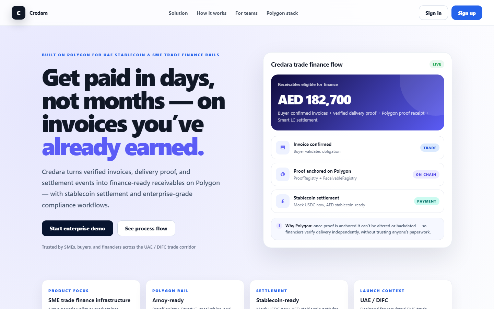
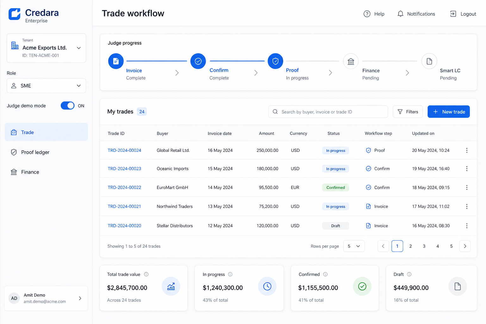
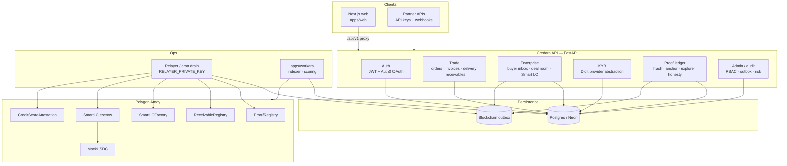
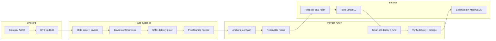
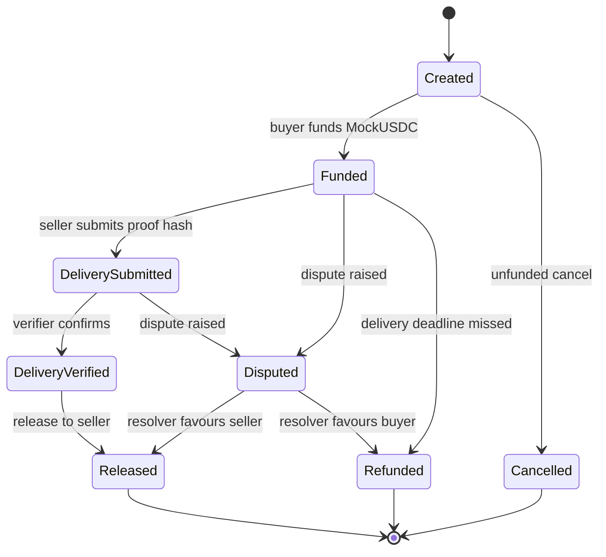
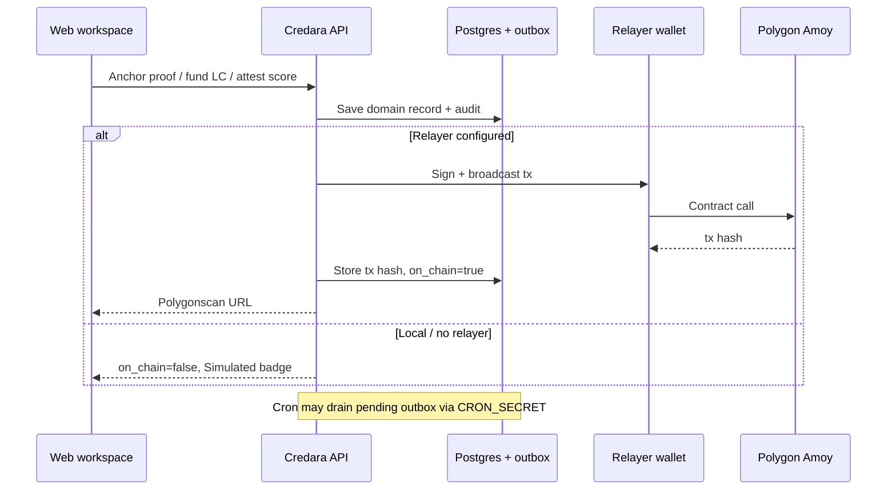
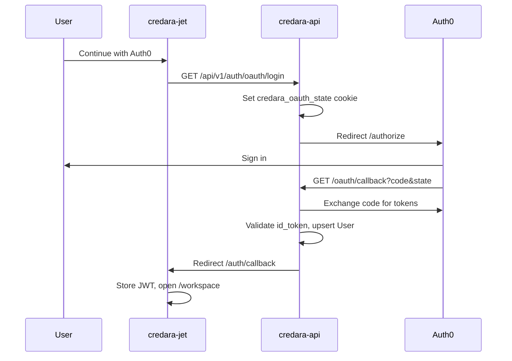

# Credara Enterprise

**Polygon-native SME trade finance for the UAE corridor.**

Credara turns buyer-confirmed invoices and verified delivery proof into finance-ready receivables, settled through programmable Smart LC stablecoin escrow on Polygon. It is **B2B trade-finance infrastructure** — not remittance, POS, or a consumer wallet.

---

## Start here (judges & reviewers)

### Aha first (60 sec)

Open the **live release tx** before the app:

| | Link |
|---|------|
| **Demo climax** | [Smart LC release on Polygonscan](https://amoy.polygonscan.com/tx/0x5743a885e54063da6c4056d73e4b49113918558fd09d8973c9074de8e57af9de) |
| **Proof anchor** | [ProofRegistry anchor tx](https://amoy.polygonscan.com/tx/0x71b1d6c74b30033b7f3ab1cad174bf75cf2003fce593dd8c7e04aa3964acf251) |

**One line:** *Supplier paid after verified delivery — bank LC would still be in paperwork.*

Full script: [docs/JUDGE_DEMO_SCRIPT.md](docs/JUDGE_DEMO_SCRIPT.md)

| | Link |
|---|------|
| **1. Open the app** | [credara-jet.vercel.app/workspace](https://credara-jet.vercel.app/workspace) |
| **2. Sign in** | Email/password (recommended for judges) or **Continue with Auth0** |
| **3. Prove the API** | [credara-api.vercel.app/docs](https://credara-api.vercel.app/docs) · [health](https://credara-api.vercel.app/health) |
| **4. Pitch deck** | [Credara_Pitch_Deck.pptx](docs/Credara_Pitch_Deck.pptx) — slide 2 = aha moment |

### 5-step judge script (~3 min)

Enable **Judge demo mode** in the sidebar, then:

1. **SME** — create order → invoice → delivery proof  
2. **Buyer** — confirm order / invoice (switch role or use buyer account)  
3. **SME** — create receivable → **anchor proof** (Polygonscan when live)  
4. **Financier** — open deal room → **fund Smart LC**  
5. **Release** — settlement when delivery verified  

Full checklist: [docs/JUDGE_READINESS_PLAN.md](docs/JUDGE_READINESS_PLAN.md) · Pitch: [docs/PITCH_STABLECOIN_CORRIDOR.md](docs/PITCH_STABLECOIN_CORRIDOR.md)

---

## Screenshots

**Landing** — UAE corridor positioning, live trade-finance flow card, Polygon stack.



**Workspace (Judge Mode)** — role nav, demo progress strip, trade workflow panels (sign in to use live).



---

## 1. System architecture

Credara is a monorepo: one web app, one API, workers, and a Solidity suite on Polygon. Commercial documents stay off-chain; only cryptographic hashes and settlement state are anchored on-chain.



### Monorepo layout

| Path | Responsibility |
|------|----------------|
| `apps/web` | Next.js 15 — marketing landing, role workspaces, Judge Mode, Auth0 callback |
| `apps/api` | FastAPI — REST `/api/v1`, Postgres, JWT, Auth0 broker, Didit KYB, Amoy writes |
| `apps/workers` | Relayer, indexer, scoring jobs (Docker / local) |
| `contracts` | Solidity 0.8.28 — ProofRegistry, ReceivableRegistry, SmartLC, factory, MockUSDC |
| `docs` | BRD, architecture, process flows, judge plan, submission |
| `infra` | Docker Compose for local full stack |
| `scripts` | `dev-local.sh`, production smoke tests |

### Bounded contexts

| Domain | Modules / routes | On-chain touchpoint |
|--------|------------------|---------------------|
| Identity & RBAC | `routes/auth.py`, `core/security.py` | — |
| Business & KYB | `modules/kyb/`, `routes/kyb.py` | — |
| Trade | `routes/trade.py` | — |
| Proof ledger | `routes/proof_ledger.py`, `services/proofs.py` | `ProofRegistry.anchorProof` |
| Receivables | `routes/trade.py` | `ReceivableRegistry` |
| Smart LC | `routes/enterprise.py`, `services/smart_lc_chain.py` | `SmartLCFactory` → `SmartLC` |
| Credit score | `services/scoring.py`, enterprise attest | `CreditScoreAttestation` |
| Network / marketplace | `routes/enterprise.py` | — |
| Audit & outbox | `models/audit.py`, `services/outbox_drain.py` | All relayer txs |

### Production controls

- **Fail-closed chain UX** — no fake Polygonscan links; simulated receipts show **Simulated** unless `ALLOW_SIMULATED_CHAIN=true` (local only).
- **Role-aware APIs** — SME, Buyer, Financier, Admin scopes on shared trade records.
- **Immutable audit log** — sensitive actions recorded with before/after payloads.
- **Outbox pattern** — domain write + chain intent in one DB transaction; relayer/cron drains safely.
- **Idempotency keys** — duplicate-safe writes on critical endpoints.
- **Deterministic proof hashing** — canonical JSON → SHA-256 for tamper-evident bundles.
- **Contract hardening** — AccessControl, Pausable, ReentrancyGuard; Slither in CI.

---

## 2. End-to-end trade finance flow

This is the core product loop judges should see in under three minutes (Judge Mode).



### Step-by-step (actors)

| Step | Actor | Action | API (examples) | DB / chain |
|------|-------|--------|--------------|------------|
| 1 | SME | Register business, pass KYB | `POST /businesses`, KYB submit | `Business`, `KYBProfile` |
| 2 | SME | Create order + invoice | `POST /trade/orders`, `POST /trade/invoices` | `Order`, `Invoice` |
| 3 | Buyer | Confirm order / invoice | `POST /trade/orders/{id}/confirm`, buyer-confirm | status → `buyer_confirmed` |
| 4 | SME | Submit delivery proof | `POST /trade/delivery-proofs` | `DeliveryProof`, confidence score |
| 5 | SME | Create proof bundle | proof service | `ProofBundle.proof_hash` |
| 6 | SME / system | Anchor on Polygon | `POST /proof-ledger/anchor` | `ProofRegistry` tx → Polygonscan |
| 7 | SME | Create receivable | `POST /trade/receivables` | `Receivable` |
| 8 | Financier | Review in deal room | `GET /deal-room/summary` | offers, evidence |
| 9 | Financier | Create + fund Smart LC | `POST /trade/smart-lcs`, `POST /smart-lcs/{id}/fund` | factory deploy, `fund()` |
| 10 | Verifier | Submit + verify delivery, release | `POST /smart-lcs/{id}/release` | `submitDelivery` → `verifyDelivery` → `release` |

**Settlement asset today:** MockUSDC on Amoy. **Production path:** same IERC-20 rails with a CBUAE-aligned AED stablecoin ([pitch](docs/PITCH_STABLECOIN_CORRIDOR.md)).

---

## 3. Smart LC settlement (on-chain)

Each Smart LC is deployed by `SmartLCFactory` with separated **verifier**, **dispute resolver**, and **pauser** roles. Sensitive commercial data stays off-chain; only hashes and state transitions are on-chain.



**API wiring (production):** `apps/api/app/services/smart_lc_chain.py` — factory `createSmartLC`, relayer mints/approves MockUSDC, `fund()`, `submitDelivery` → `verifyDelivery` → `release`. Explorer links only when `on_chain=true`.

---

## 4. Proof anchoring and relayer flow

Chain writes are never faked in production. When the relayer is configured, anchoring is synchronous with the user action; otherwise the UI shows **Simulated**.



---

## 5. Authentication flow

Password login uses OAuth2 form (`POST /api/v1/auth/login`). Auth0 uses authorization-code flow **brokered by the API** — OAuth must **start on the API host** so the state cookie matches the callback.



**Auth0 app settings**

| Field | Value |
|-------|--------|
| Allowed Callback URLs | `https://credara-api.vercel.app/api/v1/auth/oauth/callback` |
| Allowed Logout URLs | `https://credara-jet.vercel.app`, `…/workspace`, `…/login` |
| Allowed Web Origins | `https://credara-jet.vercel.app` |

---

## 6. Role workspaces

| Role | Primary surfaces | Key capabilities |
|------|------------------|------------------|
| **SME** | Trade workflow, receivables, proof ledger | Create order/invoice/proof, anchor, receivable, readiness score |
| **Buyer** | Buyer inbox | Confirm invoice, delivery, disputes |
| **Financier** | Deal room, marketplace | Review receivables, offers, fund/release Smart LC |
| **Admin** | KYB queue, audit, risk rules | Approve KYB, disputes, manual review |

All roles operate on the **same verified trade record** — not siloed demo data in production.

---

## 7. On-chain contracts (Polygon Amoy)

| Contract | Purpose |
|----------|---------|
| `ProofRegistry` | Anchor invoice/delivery proof-bundle hashes |
| `ReceivableRegistry` | On-chain receivable state / tokenization |
| `SmartLCFactory` | Deploy per-trade `SmartLC` escrows |
| `SmartLC` | Fund → delivery verify → release / dispute / refund |
| `CreditScoreAttestation` | On-chain trade credit score snapshots |
| `MockUSDC` | Demo settlement token (6 decimals); swap for regulated AED stablecoin in production |

Compile & test: `cd contracts && npm ci && npm test` · CI: [`.github/workflows/contracts.yml`](.github/workflows/contracts.yml)

---

## 8. Production deployment (Vercel)

| App | Vercel project | Root directory | URL |
|-----|----------------|----------------|-----|
| Web | `credara-jet` | `apps/web` | https://credara-jet.vercel.app |
| API | `credara-api` | `apps/api` | https://credara-api.vercel.app |

### API environment (required)

```text
ENVIRONMENT=production
DATABASE_URL                    # Neon on Vercel
JWT_SECRET                        # strong secret, not example default
CORS_ORIGINS=https://credara-jet.vercel.app
RELAYER_PRIVATE_KEY
POLYGON_CHAIN_ID=80002
POLYGON_RPC_URL
POLYGON_EXPLORER_BASE=https://amoy.polygonscan.com
PROOF_REGISTRY_ADDRESS
RECEIVABLE_REGISTRY_ADDRESS
SMART_LC_FACTORY_ADDRESS
MOCK_USDC_ADDRESS
CREDIT_SCORE_ATTESTATION_ADDRESS
KYB_PROVIDER=didit
DIDIT_API_KEY / WORKFLOW_ID / WEBHOOK_SECRET
AUTH0_DOMAIN / CLIENT_ID / CLIENT_SECRET
AUTH0_CALLBACK_URL=https://credara-api.vercel.app/api/v1/auth/oauth/callback
AUTH0_FRONTEND_REDIRECT=https://credara-jet.vercel.app/auth/callback
CRON_SECRET
```

Do **not** set `ALLOW_SIMULATED_CHAIN=true` in production unless you want soft chain failures.

### Web environment (required)

```text
NEXT_PUBLIC_API_BASE=/api/v1
API_PROXY_TARGET=https://credara-api.vercel.app
NEXT_PUBLIC_API_ORIGIN=https://credara-api.vercel.app
```

### Ops checklist

1. Deploy contracts to Amoy; grant factory `CREATOR_ROLE` to relayer.
2. Fund relayer with Amoy POL.
3. Set all addresses on API Vercel project.
4. Confirm one proof anchor + one Smart LC fund/release on Polygonscan.
5. Smoke: `python scripts/e2e_production_smoke.py`

**Guardrails:** demo `/payments/*` routers disabled when `ENVIRONMENT=production`; use `/api/v1/real/*` for persistent workflow.

---

## 9. Local development

```bash
cp .env.example .env
bash scripts/dev-local.sh api   # terminal 1 — http://localhost:8000/docs
bash scripts/dev-local.sh web   # terminal 2 — http://localhost:3000
```

Docker: `make dev` · Contracts: `cd contracts && npm ci && npm test`

---

## 10. Documentation index

| Document | Contents |
|----------|----------|
| [docs/ARCHITECTURE.md](docs/ARCHITECTURE.md) | Bounded contexts, Polygon principles |
| [docs/PROCESS_FLOWS.md](docs/PROCESS_FLOWS.md) | 16 detailed flows (actors, APIs, failure modes) |
| [docs/PROCESS_FLOW_DIAGRAMS.md](docs/PROCESS_FLOW_DIAGRAMS.md) | Full Mermaid diagram set |
| [docs/JUDGE_READINESS_PLAN.md](docs/JUDGE_READINESS_PLAN.md) | Judge criteria, P0–P2 checklist |
| [docs/PITCH_STABLECOIN_CORRIDOR.md](docs/PITCH_STABLECOIN_CORRIDOR.md) | MockUSDC → AED talk track |
| [docs/SUBMISSION.md](docs/SUBMISSION.md) | Hackathon submission draft |
| [docs/ENTERPRISE_WORKFLOW_BACKEND.md](docs/ENTERPRISE_WORKFLOW_BACKEND.md) | Buyer inbox, deal room, repayments APIs |

---

## 11. Roadmap to regulated production

| Done | Remaining |
|------|-----------|
| Auth0 + password auth, Didit KYB path, fail-closed chain UX, Smart LC factory wiring, outbox + cron, Slither CI, dual Vercel deploy | Independent Solidity audit, legal review (receivable assignment / LC), licensed settlement asset, mainnet monitoring & incident runbooks |

---

Private monorepo — Credara Enterprise. Team bios: [docs/SUBMISSION.md](docs/SUBMISSION.md).
