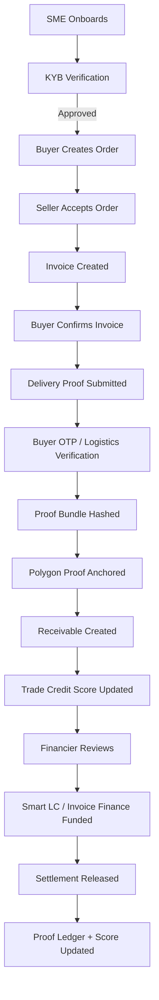
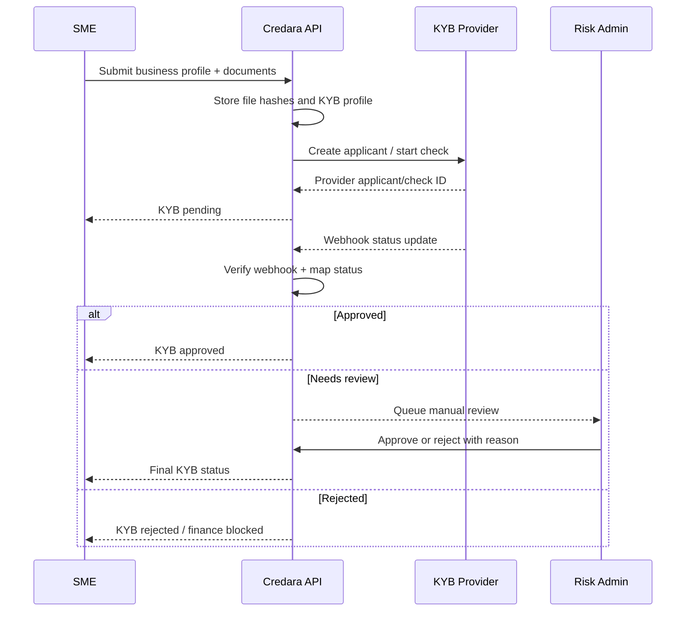
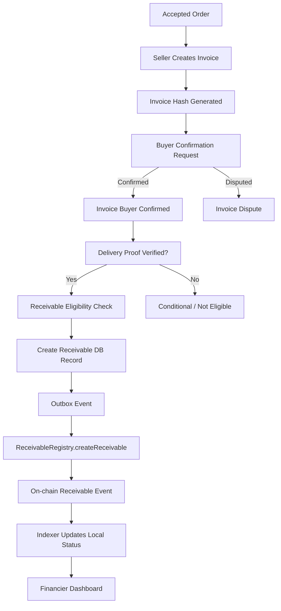
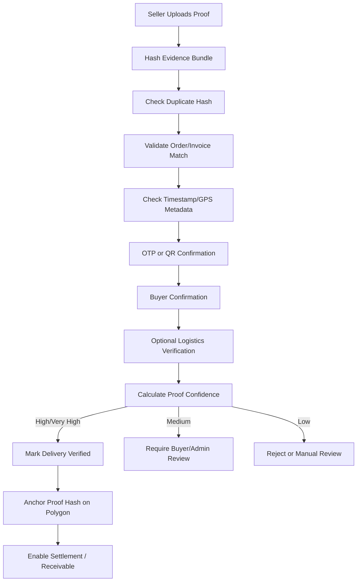
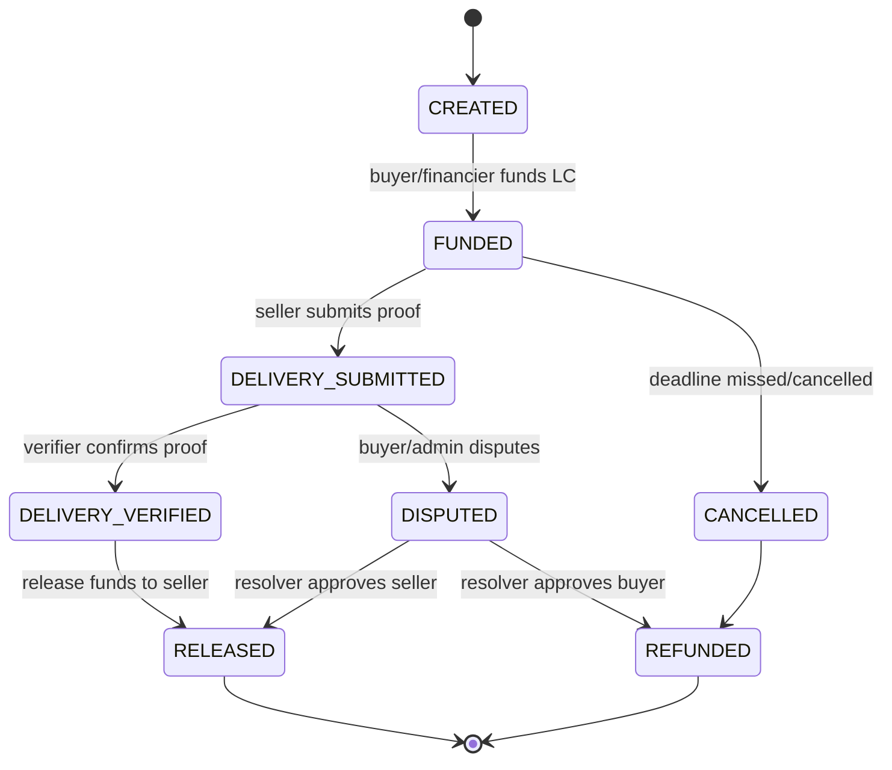
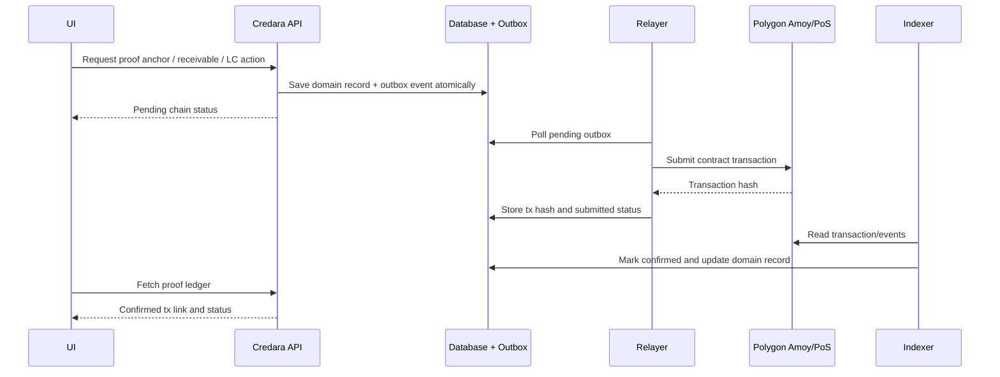
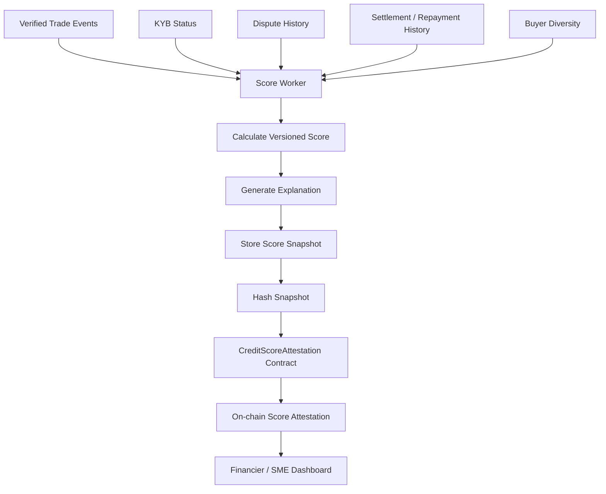
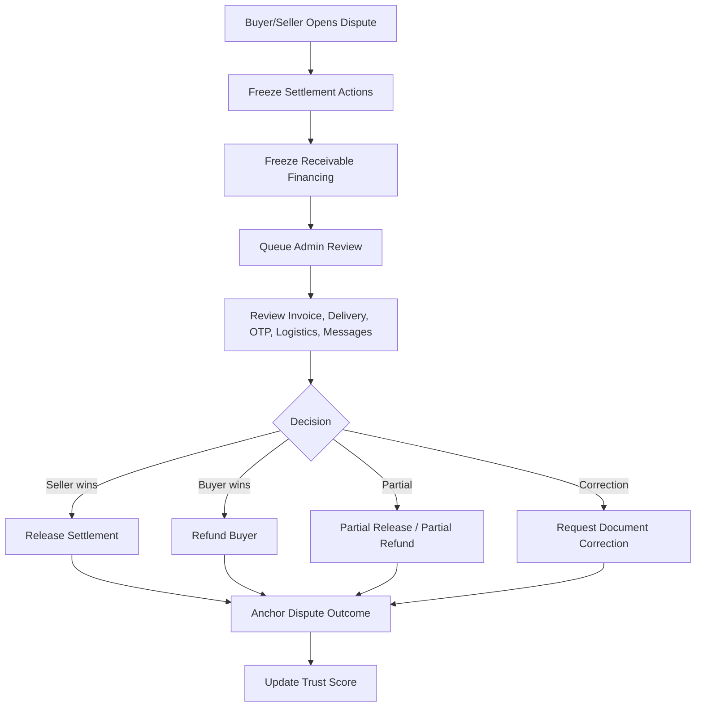

# Credara Process Flow Diagrams

These Mermaid diagrams can be rendered in GitHub, many documentation portals, and engineering tools that support Mermaid.

---

## 1. Overall Credara Trade Finance Loop

---

## 2. KYB Flow

---

## 3. Invoice to Tokenized Receivable

---

## 4. Delivery Proof Verification

---

## 5. Smart LC Settlement

---

## 6. Blockchain Outbox and Relayer

---

## 7. Credit Score Attestation

---

## 8. Dispute and Settlement Freeze

